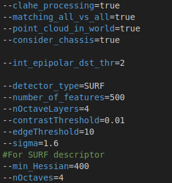
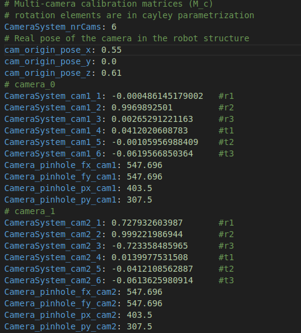

# Collision Detection and Avoidance for AUV
Package that implements functions for risk assessment of obstacles (in the form of a 3D point cloud) in underwater environments. In contains the necessary functions for feature detection, feature matching, 3D points triangulation, and risk assessment; based on our paper [Collision Detection and Avoidance for Underwater Vehicles Using Omnidirectional Vision](https://doi.org/10.3390/s22145354).

## Dependencies
The package was implemented in Ubuntu 18.04 and using ROS melodic. Also, the main data is taken from [Stonefish](https://stonefish.readthedocs.io/en/latest/) simulator. To build the project the following dependencies are also required:
 - [ROS](https://wiki.ros.org/Installation/Ubuntu)
 - Glog library
    ```console
    sudo apt install libgoogle-glog-dev
    ```
 - Gflags library
    ```console
    sudo apt install libgflags-dev
    ```
 - [OpenCV4.5](https://gist.github.com/kleysonr/c0752306bb6c021a1ff3c448996636ee) with contribution modules
 - PCL Library
    ```console
    sudo apt install libpcl-dev
    ```
 - Boost Library
    ```console
    sudo apt install libboost-all-dev
    ```
 - cv_bridge package for compatibility of ROS images and OpenCV4
    - In your catkin workspace src:
    ```console
    git clone https://github.com/fizyr-forks/vision_opencv/tree/opencv4
    cd vision_opencv
    git checkout opencv4
    ```
    - Follow this [link](https://stackoverflow.com/questions/63345411/ros-question-how-to-compile-custom-cv-bridge-with-opencv4-correctly) for further issues.
 - Stonefish simulator ([Installation](https://stonefish.readthedocs.io/en/latest/install.html)).
 - Cola2 dependencies (**TODO**)

## Installation
- Enter your catkin workspace src and clone the repository:
  ```console
  cd {your_workspace}/src
  git clone https://github.com/WayoOchoa/collision_detector_module.git
  ```
- Build the project using catkin build or catkin_make
  ```console
  catkin build collision_detector_module
  ```

## Testing the code
### Configuration files
A set of parameters should be modified to test the code according to your application. First, we have a **params.conf** file in the configuration folder, to specify parameters such as what type of descriptor to use (i.e. SIFT, SURF, ORB (TBI)), number of features to extract, matching technique, etc. Fig. 1 shows a snapshot of the parameters inside this file.



Finally, the user also needs to specify the camera parameters, which are crucial parameters for the 3D reconstruction to work. Camera rig parameters such as the number of cameras to be used, the extrinsics camera parameters, and intrinsic camera parameters MUST be provided for each camera.



### Run

## Documentation
See the package [documentation](https://wayoochoa.github.io/collision_detector_module/) for further info.
